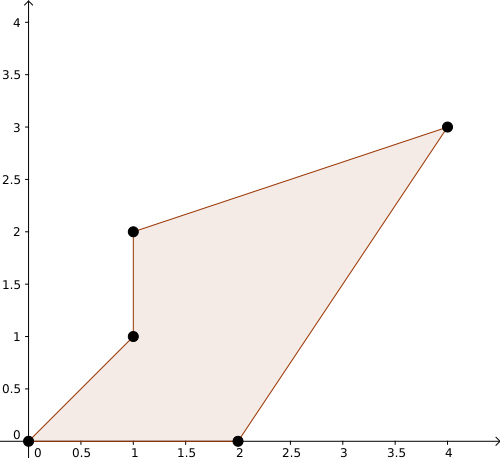

Η shoelace formula είναι ένας εύκολος τρόπος υπολογισμού του εμβαδού ενός πολυγώνου του οποίου οι ακμές δεν τέμνονται μεταξύ τους. Προσοχή πως το πολύγωνο αυτό δεν είναι απαραίτητα κυρτό. Καθώς η shoelace formula επιστρέφει εμβαδόν με πρόσημο, μπορούμε να τη χρησιμοποιήσουμε για να βρούμε εάν τρία σημεία είναι δημιουργούν δεξιόστροφη ή αριστερόστροφη γωνία.

* TOC
{:toc}
# Shoelace Formula

Δεδομένων $$n$$ σημείων με συντεταγμένες $$(x_i, y_i)$$, έχουμε ότι το εμβαδόν του πολυγώνου με άκρα τα σημεία αυτά (με τη σειρά που δίνονται) είναι ίσο με:

$$\frac{1}{2}\mid x_1\times y_2-y_1\times x_2+x_2\times y_3 - y_2\times x_3 + \ldots + x_{n-1}\times y_n-y_{n-1}\times x_n + x_n\times x_1-y_n\times y_1\mid $$

Καθώς όμως ο τύπος αυτός μοιάζει ιδιαίτερα περίπλοκος, μπορούμε να χρησιμοποιούμε τον εξής μνημονικό κανόνα:

1.  Πρώτα γράφουμε τα σημεία σε μια στήλη, φροντίζοντας να επαναλάβουμε το πρώτο σημείο στο τέλος: 

    $$\left [\begin{array}{cc}x_1 & y_1 \\ x_2 & y_2 \\ \vdots & \vdots \\ x_n & y_n \\ x_1 & y_1\end{array}\right ]$$

2. Έπειτα πολλαπλασιάζουμε διαγώνια τα ζεύγη $$x_i\times y_{i+1}$$ και τα αθροίζουμε: 

   $$\left [\begin{array}{cc}\color{red}{x_1} & y_1 \\ \color{green}{x_2} & \color{red}{y_2} \\ \color{brown}{x_3} & \color{green}{y_3} \\\vdots & \color{brown}{y_4} \\ \color{blue}{x_{n-1}} & \vdots \\ \color{magenta}{x_n} & \color{blue}{y_n} \\ x_1 & \color{magenta}{y_1}\end{array}\right ]$$

   οπότε παίρνουμε $$\color{red}{x_1\times y_2} + \color{green}{x_2\times y_3} + \color{brown}{x_3\times y_4} + \ldots + \color{blue}{x_{n-1}\times y_n} + \color{magenta}{x_n\times y_1}$$

3. Μετά πολλαπλασιάζουμε διαγώνια τα ζεύγη $$x_{i+1}\times y_i$$ και αφαιρούμε το άθροισμά τους από το προηγούμενο νούμερο: 

   $$\left [\begin{array}{cc}x_1 & \color{red}{y_1} \\ \color{red}{x_2} & \color{green}{y_2} \\ \color{green}{x_3} & \color{brown}{y_3} \\ \color{brown}{x_4} & \vdots \\ \vdots & \color{blue}{y_{n-1}} \\ \color{blue}{x_n} & \color{magenta}{y_n} \\ \color{magenta}{x_1} & y_1\end{array}\right ]$$

   οπότε παίρνουμε $$\color{red}{x_1\times y_2-y_1\times x_2} + \color{green}{x_2\times y_3 - y_2\times x_3} + \color{brown}{x_3\times y_4 -y_3\times x_4} + \ldots + \color{blue}{x_{n-1}\times y_n - y_{n-1}\times x_n} + \color{magenta}{x_n\times y_1 - y_n\times x_1}$$

4. Τέλος παίρνουμε το μισό αυτού του αριθμού, και εάν ενδιαφερόμαστε μόνο στο εμβαδόν, παίρνουμε την απόλυτη τιμή για να είναι πάντα θετικό, οπότε καταλήγουμε στον τύπο $$\frac{1}{2}\mid x_1\times y_2-y_1\times x_2 + \ldots + x_{n-1}\times y_n-y_{n-1}\times x_n + x_n\times x_1-y_n\times y_1\mid ​$$


Ο λόγος που λέγεται shoelace formula είναι ότι αν φέρουμε γραμμές που ενώνουν τα ζεύγη που ορίσαμε με το ίδιο χρώμα παραπάνω, το σχήμα θα μοιάζει με κορδόνια παπουτσιού.

## Παράδειγμα

Έστω ότι έχουμε το πολύγωνο με άκρα $$(0,0), (2,0), (4,3), (1,2), (1,1)$$.



Τότε το εμβαδόν του είναι ίσο με $$\frac{1}{2}\mid 0\times 0-0\times 2+2\times 3-0\times 4+4\times 2-3\times 1+1\times 1-2\times 1\mid = 5$$

## Υλοποίηση

```c++
#include <vector> // vector, pair
#include <math.h> // fabs

using namespace std; // vector, pair

#define X first
#define Y second
// Αυτό δεν είναι πάντα καλή ιδέα, αλλά τυχαίνει τα κεφαλαία X και Y να μην εμφανίζονται σε εντολές της c++

double polygon_area(pair<int, int> *pts, int n) {
    int out=0; // Δεν χρειάζεται να χρησιμοποιήσουμε double καθώς όλα τα σημεία είναι ακέραιοι
    for(int i=0; i<n-1; ++i) {
        out += pts[i].X*pts[i+1].Y - pts[i].Y*pts[i+1].X;
    }
    return fabs((double)out)/2;
}
```

# CCW

Μια πολύ χρήσιμη υποπερίπτωση του shoelace formula είναι ο έλεγχος για το αν τρία σημεία στρέφουν αριστερόστροφα ή δεξιόστροφα. Πιο συγκεκριμένα, δεδομένων τριών σημείων $$(x_1,y_1), (x_2, y_2), (x_3,y_3)$$, εάν το εμβαδόν που επιστρέφει το shoelace formula (χωρίς να πάρουμε απόλυτη τιμή) είναι θετικό, τότε το $$(x_3,y_3)$$ βρίσκεται αριστερά της ευθείας που ορίζουν τα $$(x_1,y_1), (x_2,y_2)$$, ενώ εάν είναι αρνητικό, τότε το $$(x_3, y_3)$$ βρίσκεται δεξιά της ευθείας αυτής. Εννοείται πως εάν είναι μηδέν, τα σημεία είναι συνευθειακά. Τα αρχικά CCW σημαίνουν Counter-ClockWise, καθώς η τιμή είναι θετική αν και μόνο αν τα σημεία στρέφουν αντίθετα της φοράς των δεικτών του ρολογιού.

## Παραδείγματα

Έστω τα σημεία $$(1,2), (2, 4), (4, 7)$$:


Η τιμή του CCW θα είναι $$\frac{1}{2}(1\times 4 - 2\times 2 + 2\times 7 - 4\times 4 + 4\times 2 - 7\times 1)=-\frac{1}{2} < 0$$, οπότε όπως βλέπουμε και στο σχήμα τα σημεία στρέφουν δεξιόστροφα.

Εάν τώρα θεωρήσουμε τα σημεία $$(1,3), (2,4), (4,7)$$:


Η τιμή του CCW θα είναι $$\frac{1}{2}(1\times 4 - 3\times 2 + 2\times 7 - 4\times 4 + 4\times 3 - 7\times 1)=\frac{1}{2}>0$$, οπότε τα σημεία στρέφουν αριστερόστροφα.

## Υλοποίηση

```c++
#include <utility> // pair (Εναλλακτικά μπορούμε να χρησιμοποιήσουμε τη βιβλιοθήκη vector)

using namespace std; // pair

#define X first
#define Y second
typedef pair<long long> pll;

long long CCW(pll A, pll B, pll C) {
    return A.X*B.Y - A.Y*B.X + B.X*C.Y - B.Y*C.X + C.X*A.Y - C.Y*A.X;
}
```

Σημειώνουμε ότι δεν χρειάζεται να χρησιμοποιήσουμε double εάν τα σημεία είναι ακέραιοι, καθώς δεν είναι ανάγκη να πάρουμε το ήμισυ της τιμής του εμβαδού.

Μπορούμε να χρησιμοποιήσουμε το CCW για να βρούμε το εμβαδόν πολυγώνου. Θεωρούμε ότι η υλοποίηση του CCW είναι όπως παραπάνω.

```c++
double polygon_area(pair<int, int> *pts, int n) {
    long long out;
    for(int i=0; i<n; ++i) {
        out += CCW(mp(0, 0), pts[i], pts[(i+1)%n]);
    }
    return fabs((double)out)/2;
}
```

# Απόδειξη

Οι παρακάτω απόδειξη δεν είναι χρήσιμη για τον διαγωνισμό.

Γνωρίζουμε ότι δεδομένων δύο διανυσμάτων $$\vec{x}, \vec{y}$$, το εξωτερικό τους γινόμενο $$\vec{x} \times \vec{y}$$ μας δίνει το εμβαδόν του παραλληλογράμμου που ορίζεται από αυτά τα δύο διανύσματα. Εάν το $$\vec{x}$$ βρίσκεται αριστερότερα του $$\vec{y}$$, τότε το εξωτερικό γινόμενο είναι θετικό, αλλιώς είναι αρνητικό. Το μισό του εξωτερικού γινομένου $$\vec{x}\times \vec{y}$$ ισούται με το τρίγωνο που ορίζεται από τα $$\vec{x}, \vec{y}$$.

Έστω ένα πολύγωνο με άκρα $$(x_i, y_i)$$. Ορίζουμε τα διανύσματα $$\vec{a_i}=(x_i, y_i)$$ με τις συντεταγμένες των σημείων αυτών. Τότε η shoelace formula ισούται με $$\frac{1}{2}\mid \sum_{i=1}^{n-1} \vec{a_i}\times \vec{a_{i+1}}+\vec{a_n}\times \vec{a_1}\mid $$. Ας θεωρήσουμε πρώτα την περίπτωση ενός τριγώνου, όπου δηλαδή $$n=3$$. Τότε, ο τύπος μας δίνει $$\frac{1}{2}\mid \vec{a_1}\times\vec{a_2} + \vec{a_2}\times\vec{a_3} + \vec{a_3}\times\vec{a_1}\mid $$. Υπάρχουν δύο περιπτώσεις:

*   Εάν τα τρία αυτά γινόμενα είναι ομόσημα, τότε μπορούμε να τα θεωρήσουμε θετικά (καθώς εάν και τα τρία είναι αρνητικά, απλά αντιστρέφουμε τη σειρά τους και αλλάζει πρόσημο το εμβαδόν, αλλά δεν μας πειράζει καθώς έχουμε απόλυτη τιμή). Στην περίπτωση αυτή, αναγκαστικά, η αρχή των αξόνων βρίσκεται μέσα στο τρίγωνο. Τότε χωρίζουμε το τρίγωνο αυτό σε τρία τρίγωνα, το τρίγωνο με άκρα $$(0,0), (x_1,y_1), (x_2,y_2)$$, το τρίγωνο με άκρα $$(0,0), (x_2,y_2), (x_3,y_3)$$ και το τρίγωνο με άκρα $$(0,0), (x_3,y_3), (x_1,y_1)$$. Τότε το εμβαδόν του τριγώνου θα είναι ίσο με το άθροισμα των εμβαδών των τριών τριγώνων, οπότε καταλήγουμε στον τύπο $$E=\frac{1}{2}\mid \vec{a_1}\times\vec{a_2} + \vec{a_2}\times\vec{a_3} + \vec{a_3}\times\vec{a_1}\mid $$
*   Εάν δεν είναι ομόσημα, τότε όπως και πριν μπορούμε να θεωρήσουμε ότι δύο από αυτά είναι θετικά και ένα είναι αρνητικό. Χωρίς βλάβη της γενικότητας έστω ότι το τρίτο γινόμενο $$\vec{a_3}\times \vec{a_1}$$ είναι αρνητικό. Τότε, το άθροισμα των πρώτων δύο γινομένων ισούται με το εμβαδόν του τετραπλεύρου $$(0,0), (x_1,y_1), (x_2,y_2), (x_3,y_3)$$. Για να βρούμε την απάντηση που ψάχνουμε, θέλουμε να αφαιρέσουμε το εμβαδόν του τριγώνου $$(0,0), (x_1,y_1), (x_3,y_3)$$, το οποίο είναι ίσο με το μισό του αντίθετου του τρίτου γινομένου. Συνεπώς, το ήμισυ του αθροίσματος των τριών γινομένων ισούται με το εμβαδόν του τριγώνου, οπότε πάλι καταλήγουμε ότι $$E=\frac{1}{2}\mid \vec{a_1}\times\vec{a_2} + \vec{a_2}\times\vec{a_3} + \vec{a_3}\times\vec{a_1}\mid $$

Μάλιστα, μπορούμε εύκολα να δούμε ότι το CCW ισχύει καθώς όταν αλλάζουμε τη σειρά των σημείων για να βεβαιωθούμε ότι το πρόσημο είναι θετικό, αλλάζει η σειρά από αριστερόστροφη σε δεξιόστροφη και αντίθετα.

Επιστρέφοντας στο αρχικό πρόβλημα, έστω ότι έχουμε αποδείξει ότι το εμβαδόν του πολυγώνου εάν αφαιρέσουμε το $$n$$-οστό σημείο ισούται με $$\frac{1}{2}\mid \sum_{i=1}^{n-2} \vec{a_i}\times \vec{a_{i+1}}+\vec{a_{n-1}}\times \vec{a_1}\mid $$. Πάλι, υπάρχουν δύο περιπτώσεις:

*   Εάν το $$(x_n,y_n)$$ βρίσκεται έξω από το πολύγωνο, τότε το τρίγωνο $$(x_{n-1},y_{n-1}), (x_n, y_n), (x_1, y_1)$$ βρίσκεται επίσης έξω από το πολύγωνο, οπότε το συνολικό εμβαδόν του πολυγώνου ισούται με $$\frac{1}{2}\mid \sum_{i=1}^{n-2} \vec{a_i}\times \vec{a_{i+1}}+\vec{a_{n-1}}\times \vec{a_1}\mid +\frac{1}{2}\mid \vec{a_{n-1}}\times \vec{a_n} + \vec{a_n}\times \vec{a_1} + \vec{a_1}\times \vec{a_{n-1}}\mid $$. Όμως, επειδή το $$(x_n, y_n)$$ βρίσκεται έξω από το πολύγωνο, τα σημεία $$(x_{n-1},y_{n-1}), (x_n, y_n), (x_1, y_1)$$ είναι αριστερόστροφα. Συνεπώς έχουμε ότι $$\frac{1}{2}\mid \vec{a_{n-1}}\times \vec{a_n} + \vec{a_n}\times \vec{a_1} + \vec{a_1}\times \vec{a_{n-1}}\mid =\vec{a_{n-1}}\times \vec{a_n} + \vec{a_n}\times \vec{a_1} + \vec{a_1}\times \vec{a_{n-1}}$$ και άρα το εμβαδόν του πολυγώνου γίνεται $$\frac{1}{2}\mid \sum_{i=1}^{n-2} \vec{a_i}\times \vec{a_{i+1}}+\vec{a_{n-1}}\times \vec{a_1} + \vec{a_{n-1}}\times \vec{a_n} + \vec{a_n}\times \vec{a_1} + \vec{a_1}\times \vec{a_{n-1}}\mid =\frac{1}{2}\mid \sum_{i=1}^{n-1} \vec{a_i}\times \vec{a_{i+1}}+\vec{a_n}\times \vec{a_1}\mid $$
*   Εάν το $$(x_n,y_n)$$ βρίσκεται μέσα στο πολύγωνο, τότε το τρίγωνο $$(x_{n-1},y_{n-1}), (x_n, y_n), (x_1, y_1)$$ βρίσκεται επίσης μέσα στο πολύγωνο, οπότε το συνολικό εμβαδόν του πολυγώνου ισούται με $$\frac{1}{2}\mid \sum_{i=1}^{n-2} \vec{a_i}\times \vec{a_{i+1}}+\vec{a_{n-1}}\times \vec{a_1}\mid -\frac{1}{2}\mid \vec{a_{n-1}}\times \vec{a_n} + \vec{a_n}\times \vec{a_1} + \vec{a_1}\times \vec{a_{n-1}}\mid $$. Όμως, επειδή το $$(x_n, y_n)$$ βρίσκεται μέσα το πολύγωνο, τα σημεία $$(x_{n-1},y_{n-1}), (x_n, y_n), (x_1, y_1)$$ είναι δεξιόστροφα. Συνεπώς έχουμε ότι $$-\frac{1}{2}\mid \vec{a_{n-1}}\times \vec{a_n} + \vec{a_n}\times \vec{a_1} + \vec{a_1}\times \vec{a_{n-1}}\mid =\vec{a_{n-1}}\times \vec{a_n} + \vec{a_n}\times \vec{a_1} + \vec{a_1}\times \vec{a_{n-1}}$$ και άρα το εμβαδόν του πολυγώνου γίνεται $$\frac{1}{2}\mid \sum_{i=1}^{n-2} \vec{a_i}\times \vec{a_{i+1}}+\vec{a_{n-1}}\times \vec{a_1} + \vec{a_{n-1}}\times \vec{a_n} + \vec{a_n}\times \vec{a_1} + \vec{a_1}\times \vec{a_{n-1}}\mid =\frac{1}{2}\mid \sum_{i=1}^{n-1} \vec{a_i}\times \vec{a_{i+1}}+\vec{a_n}\times \vec{a_1}\mid $$

Καθώς ήδη αποδείξαμε ότι ο τύπος ισχύει για τρία σημεία, επαγωγικά μπορούμε να δούμε ότι ισχύει και για οποιαδήποτε $$n\geq 3$$ σημεία, αφού μπορούμε να προσθέτουμε σημεία μέχρι να φτάσουμε στο $$n$$.

# Προβλήματα

[Spoj LINESEG](http://www.spoj.com/problems/LINESEG/)

[Spoj VISION](http://www.spoj.com/problems/VISION/)

[Codeforces 198 Div. 2 B](http://codeforces.com/contest/340/problem/B)

