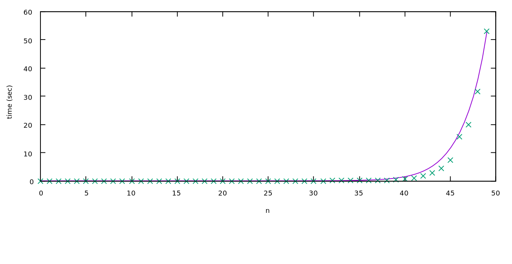
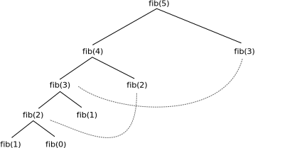

Ο Δυναμικός Προγραμματισμός, ή αλλιώς Dynamic Programming (DP), αναφέρεται σε έναν τρόπο προσέγγισης προβλημάτων, δηλαδή δεν είναι κάποιος συγκεκριμένος αλγόριθμος, αλλά πιο πολύ μια τεχνική.  Εφαρμόζεται σε προβλήματα που μπορούν να λυθούν αναδρομικά, και μας δίνει τη δυνατότητα να τα λύσουμε με επανάληψη αντί για αναδρομή (περαιτέρω λεπτομέρειες παρακάτω).

Λόγω της ευρύτητας του Δυναμικού Προγραμματισμού, θα τον εισάγουμε χρησιμοποιώντας διάφορα παραδείγματα.

* TOC
{:toc}
## Αναδρομή, Memoization και Bottom-up

Υπάρχουν δύο κατηγορίες δυναμικού προγραμματισμού· το memoization και το bottom-up. Παρακάτω, θα δούμε πώς να μεταβούμε από μια αναδρομική λύση σε λύσεις δυναμικού προγραμματισμού που βελτιώνουν την πολυπλοκότητα των προγραμμάτων. Επιπλέον, θα δούμε και την πρακτική διαφορά μεταξύ λύσεων που χρησιμοποιούν memoization και bottom-up.

### Αριθμοί Fibonacci

Οι αριθμοί Fibonacci είναι μια ακολουθία ακεραίων, στην οποία κάθε αριθμός είναι το άθροισμα των δύο προηγούμενων, ξεκινώντας από το $$0$$ και το $$1$$. 

$$0, 1, 1, 2, 3, 5, 8, 13, 21, 34, 55, 89, 144, \ldots$$

Πιο επίσημα, αν $$F_n$$ είναι ο $$n$$-οστός αριθμός Fibonacci, τότε ισχύουν τα εξής:

$$F_0=0, F_1=1, F_n=F_{n-1}+F_{n-2}$$

#### Αναδρομή

Αναδρομή είναι μια προγραμματιστική τεχνική, στην οποία μια συνάρτηση καλεί τον εαυτό της. Όπως είναι λογικό, πρέπει αυτή η συνάρτηση να τερματίζει κάποια στιγμή, που σημαίνει ότι πρέπει να ορίσουμε κάποιες βασικές τιμές. Ας δούμε το παράδειγμα των αριθμών Fibonacci.

```c++
int fib(int n) {
    assert(n>=0); // Δεν είναι απαραίτητο, αλλά απαγορεύει αρνητικές τιμές του n
    if(n<=1) { // fib(0)=0, fib(1)=1
        return n;
    }
    else { // fib(n) = fib(n-1) + fib(n-2)
        return fib(n-1) + fib(n-2);
    }
}
```

Αρχικά, ας δείξουμε ότι αυτή η συνάρτηση τερματίζει. Εάν $$n=0$$ ή $$n=1$$, τότε η συνάρτηση τερματίζει αμέσως, χωρίς να εκτελέσει αναδρομή. Έστω ότι η συνάρτηση τερματίζει για κάθε $$n\leq m$$, για κάποιο $$m$$. Τότε, το `fib(m+1)`, θα καλέσει τα `fib(m)` και `fib(m-1)`, τα οποία ήδη γνωρίζουμε ότι τερματίζουν. Άρα, βλέπουμε ότι επαγωγικά, η συνάρτηση `fib` τερματίζει για κάθε μη αρνητικό αριθμό.

Αντίστοιχα μπορούμε να δείξουμε ότι επιστρέφει και τη σωστή απάντηση, αλλά αυτό φαίνεται και διαισθητικά, αφού η αναδρομική συνάρτηση που παραθέσαμε ταυτίζεται με τον ορισμό της ακολουθίας Fibonacci.

Δυστυχώς όμως, ο αλγόριθμος αυτός είναι πολύ αργός.



Μπορούμε να δούμε από την παραπάνω μέτρηση, ότι η πολυπλοκότητα του αλγορίθμου είναι εκθετική. Πράγματι, αν $$d(n)$$ είναι το πλήθος των βημάτων που εκτελεί το $$fib(n)$$, ισχύει ότι $$d(0)=1, d(1)=1, d(n)=d(n-1)+d(n)+1$$, που μας δίνει ότι $$d(n) \geq fib(n)$$. Αφού γνωρίζουμε ότι οι αριθμοί Fibonacci ανεβαίνουν εκθετικά, θα ισχύει ότι και η πολυπλοκότητα της πολυπλοκότητας του αλγορίθμου ανεβαίνει επίσης εκθετικά.

Για να βελτιώσουμε τη λύση μας, αρκεί μία απλή παρατήρηση. Η τιμή της συνάρτησης `fib(n)` εξαρτάται μόνο από το `n` (η παρατήρηση αυτή μπορεί να είναι αυτονόητη καθώς το `n` είναι το μόνο όρισμα της, αλλά δεν ισχύει για κάθε συνάρτηση στον προγραμματισμό. Μπορείτε να γράψετε μια συνάρτηση η οποία επιστρέφει διαφορετικές τιμές με τα ίδια ορίσματα;). Συνεπώς, οποιαδήποτε στιγμή την καλέσουμε, θα περιμένουμε την ίδια απάντηση. Όμως, η παραπάνω λύση, υπολογίζει πολλές φορές την τιμή της συνάρτησης για κάθε `n`.  Για παράδειγμα, εάν καλέσουμε `fib(5)`, αυτή θα καλέσει `fib(4)` και `fib(3)`. Αν συνεχίσουμε, μπορούμε να δούμε ότι η αναδρομικές κλήσεις θα είναι κάπως έτσι:


Η τιμή της συνάρτησης `fib(3)` θα υπολογιστεί δύο φορές, ενώ η τιμή της συνατησης `fib(2)` θα υπολογιστεί τρεις φορές. Για να βελτιώσουμε την ταχύτητα του αλγορίθμου μας, θα θέλαμε να υπολογίζουμε κάθε τιμή μία το πολύ φορά.

#### Memoization

Η φυσική λύση σε αυτό το πρόβλημα είναι απλά να αποθηκεύουμε την τιμή της συνάρτησης την πρώτη φορά που την υπολογίζουμε. Ας δείξουμε την αλλαγή στον αλγόριθμό μας.

```c++
int memfib[MAXNUM];
bool hascomp[MAXNUM]; // Στην C/C++ οι global μεταβλητές αρχικοποιούνται στο 0

int fib(int n) {
    if(!hascomp[n]) {
        if(n<=1) {
            memfib[n]=n;
        }
        else {
            memfib[n]=fib(n-1) + fib(n-2);
        }
        hascomp[n]=true;
    }
    return memfib[n];
}
```

Μπορούμε λοιπόν να δούμε ότι η τιμή του `fib(n)` υπολογίζεται μία το πολύ φορά για κάθε `n`. Συνεπώς, η πολυπλοκότητα του αλγορίθμου εύρεσης του $$n$$-οστού αριθμού Fibonacci χρησιμοποιώντας memoization είναι $$O(n)$$. 

Έτσι, στο παράδειγμα που είδαμε και πριν με τον υπολογισμό της τιμής του `fib(5)`, όταν θέλουμε να βρούμε την τιμή του `fib(2)` και του `fib(3)` δεν τα ξαναϋπολογίζουμε.



Υπάρχει όμως ένα πρόβλημα. Εάν προσπαθήσουμε να τρέξουμε το παραπάνω πρόγραμμα, φαίνεται να λειτουργεί σωστά για τιμές του $$n$$ μικρότερες του $$2\cdot 10^5$$, αλλά για μεγαλύτερες τιμές εμφανίζει Segmentation Fault! Για λόγους που δεν είναι εύκολο να εξηγήσουμε, οι συναρτήσεις *σε όλες τις γλώσσες του διαγωνισμού πληροφορικής* έχουν ένα άνω όριο αναδρομής.

#### Bottom-up

Τώρα θα μετατρέψουμε την παραπάνω λύση μας σε πλήρως επαναληπτική λύση. Ας παρατηρήσουμε ότι για να υπολογίσουμε την τιμή της συνάρτησης `fib` στο $$n$$, θα υπολογίσουμε πρώτα την τιμή της σε κάθε αριθμό μικρότερο του $$n$$. Επίσης, αντίστροφα, εάν έχουμε υπολογίσει την τιμή της συνάρτησης `fib` σε κάθε αριθμό μικρότερο του $$n$$, μπορούμε τότε να βρούμε την τιμή της συνάρτησης στο $$n$$.

Σε γενικές γραμμές, οι λύσεις bottom-up λύνουν πρώτα ένα *υποπρόβλημα* για μικρότερες τιμές από αυτήν που θέλουμε να υπολογίσουμε, και έπειτα χρησιμοποιούν τις μικρότερες λύσεις για να "χτίσουν" την μεγαλύτερη. Για αυτό, πρέπει να βρούμε την σωστή σειρά για να λύσουμε τα υποπροβλήματα, έτσι ώστε να έχουμε ήδη όλες τις απαντήσεις που χρειαζόμαστε πριν προχωρήσουμε. 

Στο συγκεκριμένο πρόβλημα, η σειρά με την οποία πρέπει να λύσουμε τα υποπροβλήματα είναι αρκετά απλή· λύνουμε πρώτα τα βασικά υποπροβλήματα για $$0$$ και $$1$$, και έπειτα λύνουμε με τη σειρά για τις τιμές $$2, 3,\ldots, n$$.

```c++
int memfib[MAXNUM];

int fib(int n) {
    memfib[0]=0;
    memfib[1]=1;
    for(int i=2; i<=n; ++i) {
        memfib[i]=memfib[i-1] + memfib[i-2];
    } 
    return memfib[n];
}
```

Παρόλο που δεν άλλαξε η πολυπλοκότητα, ο κώδικας έγινε απλούστερος και μικρότερος. Βέβαια, το πρόβλημα της λύσης με memoization δεν υπάρχει πλέον, καθώς δεν χρησιμοποιούμε αναδρομή.


### Maximum weighted independent set

**Εκφώνιση:** Δίνονται $$n$$ αριθμοί σε σειρά, $$a_{1},\ldots,a_{n}$$. Να επιλέξετε κάποιους αριθμούς έτσι ώστε να μεγιστοποιήσετε το άθροισμά τους, με την συνθήκη ότι δεν μπορείτε να επιλέξετε συνεχόμενους αριθμούς.

*Σας συστήνουμε να προσπαθήσετε να λύσετε το πρόβλημα μόνοι σας πριν προχωρήσετε.*

#### Αναδρομή

Όπως και πριν, ας ξεκινήσουμε με μια αναδρομική λύση. Έστω ότι θέλουμε να λύσουμε το πρόβλημα για τους πρώτους $$k$$ αριθμούς. Έχουμε δύο επιλογές: είτε θα συμπεριλάβουμε τον $$k$$-οστό αριθμό, είτε όχι.

* Εάν συμπεριλάβουμε τον $$k$$-οστό αριθμό, τότε γνωρίζουμε ότι δεν θα συμπεριλάβουμε τον $$(k-1)$$-οστό αριθμό, αλλά δεν μας επηρεάζει καθόλου το αν θα συμπεριλάβουμε ή όχι τον $$(k-2)$$-οστό αριθμό. Άρα σε αυτήν την περίπτωση, η απάντησή μας ισούται με την βέλτιστη απάντηση για τους πρώτους $$k-2$$ αριθμούς, συν την τιμή του $$k$$-οστού αριθμού. 
* Εάν δεν συμπεριλάβουμε τον $$k$$-οστό αριθμό, τότε δεν μας επηρεάζει το αν θα συμπεριλάβουμε ή όχι τον $$(k-1)$$-οστό αριθμό. Άρα, η απάντησή μας θα ισούται με την βέλτιστη απάντηση για τους πρώτους $$k-1$$ αριθμούς, συν την τιμή του $$k$$-οστού αριθμού.

Από αυτές τις δύο περιπτώσεις, θα επιλέξουμε αυτή που μας δίνει το μεγαλύτερο άθροισμα. Μένουν βέβαια οι δύο βασικές περιπτώσεις:

* Για $$k=0$$, η απάντηση είναι 0.
* Για $$k=1$$, η απάντηση είναι $$a_1$$, αν $$a_1\geq 0$$, αλλιώς $$0$$.

Από τις παραπάνω παρατηρήσεις μπορούμε να δημιουργήσουμε μία αναδρομική λύση:

```c++
int a[MAXN];

int maxsum(int k) {
    if(k==0) {
        return 0;
    }
    if(k==1) {
        return max(0, a[1]); 
    }
    return max(a[k] + maxsum(k-2), maxsum(k-1));
}

int solve(int n) {
    return maxnum(n);
}
```

Η απάντηση δίνεται καλώντας `maxsum(n)`.

Δεν είναι δύσκολο να δούμε ότι, όπως και στους αριθμούς Fibonacci, η πολυπλοκότητα του παραπάνω αλγορίθμου είναι εκθετική. Ας περάσουμε λοιπόν στην λύση του δυναμικού προγραμματισμού (εάν θέλετε, δοκιμάστε να μετατρέψετε την παραπάνω λύση σε memoization).

#### Memoization

Το μόνο που έχουμε να κάνουμε για να εισάγουμε memoization σε μία αναδρομική λύση είναι **να αποθηκεύουμε την απάντηση της συνάρτησης για κάθε τιμή που έχουμε υπολογίσει**. Επομένως, ο παραπάνω κώδικας βελτιώνεται εύκολα:

```c++
int a[MAXN];
int mem[MAXN];
bool hascomp[MAXN];

int maxsum(int k) {
    if(hascomp[k]) {
        return mem[k];
    }
    if(k==0) {
        return 0;
    }
    if(k==1) {
        return max(0, a[1]); 
    }
    mem[k] = max(a[k] + maxsum(k-2), maxsum(k-1));
    hascomp[k] = true;
    return mem[k];
}

int solve(int n) {
    return maxnum(n);
}
```

Καθώς για κάθε $$k$$ θα ορίσουμε το πολύ μία φορά `hascomp[k]=true` (αφού εάν ήδη το έχουμε θέσει σε `true`, θα σταματήσουμε την αναδρομή), γνωρίζουμε ότι θα καλέσουμε την συνάρτηση `maxsum` το πολύ $$2\cdot\text{MAXN}$$ όπου $$\text{MAXN}$$ είναι η μέγιστη τιμή του $$n$$.

*Σημείωση: Θα μπορούσαμε να αποθηκεύσουμε και τις τιμές για $$k=0, k=1$$, αλλά δεν θα άλλαζε η πολυπλοκότητα.*

#### Bottom-up

Όπως και πριν, θα μετατρέψουμε εύκολα την αναδρομική λύση σε επαναληπτική.

```c++
int a[MAXN], dp[MAXN];

int solve(int n) {
    dp[0]=0;
    dp[1]=max(0, a[1]);
    for(int i=2; i<n; ++i) {
        dp[i]=max(a[i] + dp[i-2], dp[i-1]);
    }
    return dp[n];
}
```

Ένα σημαντικό στοιχείο του δυναμικού προγραμματισμού που θα θέλαμε να αναφέρουμε, είναι το γεγονός ότι δεν μας δίνει την απάντηση μόνο για το ζητούμενο $$n$$, αλλά και για κάθε μικρότερο, οπότε μπορούμε να χρησιμοποιήσουμε τον πίνακα που δημιουργήσαμε την πρώτη φορά για να βρούμε την απάντηση και τις επόμενες.

### Memoization vs. Bottom-up

Παραπάνω είδαμε κάποια βασικά προβλήματα που μας εισήγαγαν στις τεχνικές του memoization και του bottom-up δυναμικού προγραμματισμού. Στα προβλήματα αυτά, και οι δύο λύσεις έχουν πανομοιότυπη πολυπλοκότητα, οπότε γιατί να μαθαίνουμε και τις δύο τεχνικές; Εν συντομία, υπάρχουν κάποια προβλήματα που απαιτούν τη χρήση του bottom-up, και κάποια άλλα στα οποία η χρήση του memoization είναι πιο εύκολη. Είναι πολύ σπάνιο όμως να υπάρχει κάποιο πρόβλημα το οποίο να λύνεται (σε βέλτιστη πολυπλοκότητα) με memoization αλλά όχι με bottom-up.

#### Θετικά του Memoization

* **Εύκολο στην υλοποίηση.** Αρχικά, όπως είδαμε, έχοντας μια αναδρομική λύση μπορούμε ευκολότατα να εισάγουμε memoization. Εννοείται βέβαια πως αυτός είναι ένας καθαρά υποκειμενικός παράγοντας , καθώς για κάποιους το bottom-up είναι πιο εύκολο από την αναδρομή. Το bottom-up όμως, εισάγει μια επιπλέον δυσκολία: πρέπει να διακρίνουμε την σειρά που μπορούμε να υπολογίσουμε τις απαντήσεις. Αν και στα παραπάνω προβλήματα η σειρά αυτή ήταν προφανής, υπάρχουν κάποιες περιπτώσεις στις οποίες το να βεβαιωθούμε ότι έχουμε προϋπολογίσει όλες τις απαραίτητες τιμές είναι αρκετά δύσκολο.
* **Υπολογίζει μόνο τις απαραίτητες τιμές.** Αν και αυτό είναι σπανίως σχετικό, υπάρχουν κάποια προβλήματα στα οποία το memoization μπορεί να αποκλείσει ένα μεγάλο μέρος τιμών που δεν χρειάζεται να υπολογίσει. Συνήθως, αυτό δεν βελτιώνει την πολυπλοκότητα, αλλά κάνει το πρόγραμμα ταχύτερο κατά μία σταθερά.

#### Θετικά του Bottom-up

* **Δεν εμφανίζει προβλήματα σε γραμμικές λύσεις.** Όπως είδαμε παραπάνω στον υπολογισμό των αριθμών Fibonacci, το memoization εμφανίζει segmentation fault όταν φτάσει το όριο της αναδρομής. Αυτό το πρόβλημα μπορεί να δημιουργηθεί μόνο σε γραμμικές λύσεις, καθώς μόνο σε αυτές τις περιπτώσεις υπάρχει περίπτωση να φτάσουμε το όριο της αναδρομής. 

* **Ελαφρώς ταχύτερος κώδικας.** Για λόγους που δεν είναι εύκολο να εξηγήσουμε σε αυτό το άρθρο, αλλά έχουν να κάνουν με τον τρόπο που λειτουργεί ο υπολογιστής, πολλές φορές η bottom-up υλοποίηση είναι ταχύτερη κατά μία σταθερά από το memoization. Όπως και πριν όμως, αυτό δεν βελτιώνει την πολυπλοκότητα.
* **Μακράν λιγότερη μνήμη.** Σε ορισμένα προβλήματα (κάποια από τα οποία θα δούμε παρακάτω), η λύση bottom-up μπορεί να πετύχει καλύτερη πολυπλοκότητα μνήμης εάν φροντίσουμε να την χρησιμοποιήσουμε σωστά. Κάτι τέτοιο δεν μπορεί να γίνει με το memoization.
* **Δυνατότητα βελτιστοποίησης.** Υπάρχουν ορισμένες τεχνικές που ονομάζονται DP-optimizations και βελτιώνουν την πολυπλοκότητα των λύσεων bottom-up. Αυτές οι τεχνικές είναι αρκετά προχωρημένες, και θα τις καλύψουμε σε κάποιο άλλο άρθρο. Σε κάποια προβλήματα όμως, μπορούμε να κάνουμε ορισμένες παρατηρήσεις που βελτιώνουν την πολυπλοκότητα της λύσης, χωρίς αυτές οι παρατηρήσεις να εφαρμόζονται σε κάποια μεγάλη κατηγορία προβλημάτων. Ένα από αυτά τα προβλήματα είναι το Longest Increasing Subsequence που θα εξετάσουμε παρακάτω.

Συνεπώς, σας συνιστούμε να χρησιμοποιείτε memoization σε απλά προβλήματα στα οποία μπορείτε εύκολα να γράψετε μια αναδρομική λύση και να επιβεβαιώσετε ότι θα περάσει τα χρονικά όρια. Προσοχή όπως αναφέραμε και παραπάνω σε γραμμικές λύσεις όπου υπάρχει η πιθανότητα το memoization να δημιουργήσει segmentation fault για πολύ μεγάλους αριθμούς. Σε πιο δύσκολα προβλήματα, στα οποία ούτως ή άλλως θα αφιερώσετε επιπλέον χρόνο, σας συνιστούμε να χρησιμοποιείτε λύσεις bottom-up. Στο υπόλοιπο άρθρο θα αναφερόμαστε μόνο σε λύσεις bottom-up.

## DP με μη προφανή σχέση αναδρομής

### Unbounded Knapsack

**Εκφώνιση:** Δίνονται $$n$$ αντικείμενα, κάθε ένα από τα οποία έχει μια αξία $$v_i$$ και ζυγίζει $$w_i$$ κιλά. Έχουμε μια τσάντα που αντέχει συνολικά $$W$$ κιλά. Θέλουμε να μεγιστοποιήσουμε τη συνολική αξία των αντικειμένων που βάζουμε στην τσάντα, έτσι ώστε να μην υπερβούν το όριο βάρους.

Το πρόβλημα αυτό ίσως το πιο γνωστό πρόβλημα δυναμικού προγραμματισμού, και υπάρχουν πολλές παραλλαγές του (μία από τις οποίες θα δούμε παρακάτω). Η εκδοχή αυτή (unbounded knapsack) έχει αποδειχτεί ότι είναι NP-Hard, που σημαίνει ότι κατά πάσα πιθανότητα δεν υπάρχει πολυωνυμική λύση ([εάν βρείτε μία, κερδίζετε τουλάχιστον ένα εκατομμύριο δολάρια](https://en.wikipedia.org/wiki/P_versus_NP_problem)). Αυτό όμως δεν σημαίνει ότι δεν μπορούμε να βρούμε μία *ψευδο*πολυωνυμική.

*Ψευδοπολυωνυμικοί* είναι οι αλγόριθμοι που έχουν πολυωνυμική πολυπλοκότητα σε σχέση με έναν παράγοντα που παρουσιάζεται ως αριθμητική τιμή στην είσοδο, χωρίς να επηρεάζει κατά πολύ το μήκος της εισόδου. Στην συγκεκριμένη περίπτωση, η πολυπλοκότητα βασίζεται στην μέγιστη τιμή νομίσματος. Αν και η μέγιστη τιμή νομίσματος επηρεάζει το μήκος της εισόδου (καθώς θα χρειάζονται περισσότερα ψηφία), η πολυπλοκότητα του αλγορίθμου με βάση το πλήθος των ψηφίων των νομισμάτων είναι *εκθετική* (σκεφτείτε γιατί, δεν είναι προφανές).

**Παρατήρηση:** Εάν έχουμε λύσει το πρόβλημα για μικρότερες τιμές του $$W$$, τότε μπορούμε να τις χρησιμοποιήσουμε για να λύσουμε το μεγαλύτερο πρόβλημα. Συγκεκριμένα, εάν $$m(W^\prime)$$ είναι η μέγιστη τιμή που μπορούμε να χωρέσουμε σε σάκο με μέγιστο βάρος $$W^\prime$$, για κάποιο $$W^\prime$$, τότε $$m(W) = \max_i(v_i+m(W-w_i))$$. Αυτό λοιπόν μας δίνει μια σχέση αναδρομής με την οποία μπορούμε κατευθείαν να προχωρήσουμε σε λύση bottom-up.

```c++
int v[MAXN], w[MAXN], dp[MAXW];

int knapsack(W, n) {
    dp[0]=0;
    for(int j=1; j<=W; ++j) {
        dp[j]=dp[j-1];
        for(int i=0; i<n; ++i) {
            if(w[i]<=j) {
                dp[j]=max(dp[j], dp[j-w[i]]+v[i]);
            }
        }
    }
    return dp[W];
}
```

Προσοχή ότι στον παραπάνω κώδικα, ο πίνακας `dp[i]` αντιπροσωπεύει τη μέγιστη τιμή που μπορούμε να πετύχουμε χρησιμοποιώντας βάρος $$i$$ ή και λιγότερο.

### DP σε ψηφία

**Εκφώνιση:** Δίνεται ένας αριθμός $$n\leq 10^{18}$$. Να βρεθεί το άθροισμα των ψηφίων όλων των ακεραίων από το $$1$$ μέχρι το $$n-1$$.

Σε αυτό το πρόβλημα θα εξετάσουμε μια σχετικά συχνή κατηγορία προβλημάτων DP που λύνεται με έναν συγκεκριμένο τρόπο.  Εννοείται πως ο αριθμός $$n$$ είναι υπερβολικά μεγάλος για να αθροίσουμε απλά όλα τα ψηφία μέχρι τον $$n$$. Συνεπώς, θα πρέπει να το αντιμετωπίσουμε πιο έξυπνα.

#### Αναδρομή

Ας εξετάσουμε πρώτα μια πιο εύκολη μορφή του προβλήματος· έστω ότι το $$n$$  είναι δύναμη του δέκα. Τότε αν $$S(n)$$ είναι η απάντηση του προβλήματός μας, μπορούμε να βρούμε μια αναδρομική λύση: για κάθε περίπτωση της τιμής του πρώτου ψηφίου, μπορούμε να βρούμε την απάντηση για τα υπόλοιπα ψηφία (δηλαδή μέχρι το $$n/10$$) και να πολλαπλασιάσουμε το νέο ψηφίο με το πλήθος των αριθμών στο οποίο βρίσκεται (δηλαδή $$n/10$$). Άρα, έχουμε $$S(n)=\sum_{i=0}^{9} (S(n/10)+ i\cdot n/10) $$ ή αλλιώς $$S(n) = 10\cdot S(n/10)+45\cdot n/10$$.

Για να γενικεύσουμε, θα θεωρήσουμε μια άλλη συνάρτηση $$T(n)$$, η οποία μας δίνει την απάντηση για τιμές του $$n$$ που δεν είναι απαραίτητα δυνάμεις του δέκα.  Έστω $$m_i$$ το $$i$$-οστό ψηφίο του $$m$$, όπου $$m_1$$ είναι το αριστερότερο ψηφίο. Πάλι, θα θεωρήσουμε όλες τις πιθανές τιμές για το πρώτο ψηφίο, όμως αυτή τη φορά θα προσέξουμε ότι δεν μπορεί να είναι μεγαλύτερο από το πρώτο ψηφίο του $$n-1$$. Θα διακρίνουμε δύο περιπτώσεις. Εάν το πρώτο ψηφίο είναι μικρότερο του $$(n-1)_1$$, τότε τα υπόλοιπα ψηφία των αριθμών αυτών μπορούν να είναι μέχρι και το $$9$$, που σημαίνει ότι μπορούμε να χρησιμοποιήσουμε την συνάρτηση $$S()$$. Εάν όμως το πρώτο ψηφίο είναι ίσο του $$(n-1)_1$$, τότε θα συνεχίσει να ισχύει ότι δεν μπορούμε να υπερβούμε το $$i$$-οστό ψηφίο του $$n-1$$.

Για διευκόλυνση της υλοποίησης, η συνάρτησή μας δεν θα βασίζεται στο $$ n$$, αλλά στα ψηφία του με βάση την δεκαδική του αναπαράσταση. Επιπλέον, δεν χρειαζόμαστε δύο συναρτήσεις, αλλά μπορούμε να συμπεριλάβουμε μία επιπλέον μεταβλητή η οποία διακρίνει τις δύο περιπτώσεις. Τέλος, η συνάρτησή μας υπολογίζει το άθροισμα των ψηφίων των αριθμών μέχρι και το $$n$$.

```c++
vector<int> digits;

long long sumdig(int idx, bool powten) {
    if(idx<0) {
        return 0;
    }
    long long out=0, proddig=1;
    for(int i=0; i<idx; ++i) {
        proddig *= digits[i]+1;
    }
    if(!powten) {
        out += sumdig(idx-1, false) + proddig*digits[idx];
    }
    for(int i=0; i<powten?10:digits[idx]; ++i) { // Εάν powten=true, τότε i<10, αλλιώς i<digits[idx]
        out += sumdig(idx-1, true) + pow(10, idx)*i;
    }
    return out;
}

int main() {
    int n;
    scanf("%d", &n);
    while(n>0) {
        digits.push_back(n%10);
        n/=10;
    }
    printf("%d\n", sumdig(digits.size()-1, false));
}
```

Θεωρούμε πως η λύση με memoization σας είναι πια εύκολη, δεδομένης της αναδρομικής λύσης.

#### Bottom-up

Όπως και στα προηγούμενα προβλήματα που είδαμε, η λύση bottom-up θα λύσει τα υποπροβλήματα με τέτοια σειρά έτσι ώστε να έχει όλες τις προαπαιτούμενες γνώσεις για να προχωρήσει. Στη συγκεκριμένη περίπτωση, θα βρει πρώτα τις τιμές της συνάρτησης $$S$$, και έπειτα της $$T$$.

```c++
long long dp[20][2];
long long proddig[20]

long long sumdig(vector<int> digits) {
    dp[0][0] = 45;
    dp[0][1] = digits[0]*(digits[0]+1)/2;
    proddig[0] = digits[0];
    for(int i=1; i<digits.size(); ++i) {
    	proddig[i] = proddig[i-1]*(digits[i]+1);
    }
    for(int i=1; i<digits.size(); ++i) {
        dp[i][0] = dp[i-1][0]*10 + pow(10, i)*45;
    }
    for(int i=1; i<digits.size(); ++i) {
        dp[i][1] = dp[i-1][1] + proddig[i-1]*digits[i];
        dp[i][1] += dp[i-1][0]*(digits[i]) + pow(10, i)*(digits[i]*(digits[i]+1)/2);
    }
    return dp[digits.size()-1][1];
}
```


*Ερώτηση:* Είδαμε ότι ο αλγόριθμος που δώσαμε για το πρόβλημα coin change είναι ψευδοπολυωνυμικός. Στο συγκεκριμένο πρόβλημα, η πολυπλοκότητα πάλι εξαρτάται από αριθμητική τιμή του προβλήματος. Είναι όμως ο αλγόριθμος ψευδοπολυωνυμικός ή πολυωνυμικός;

## Βελτίωση πολυπλοκότητας

### 0/1 Knapsack

**Εκφώνιση:** Δίνονται $$n$$ αντικείμενα, κάθε ένα από τα οποία έχει μια αξία $$v_i$$ και ζυγίζει $$w_i$$ κιλά. Έχουμε μια τσάντα που αντέχει συνολικά $$W$$ κιλά. Θέλουμε να μεγιστοποιήσουμε τη συνολική αξία των αντικειμένων που βάζουμε στην τσάντα, έτσι ώστε να μην υπερβούν το όριο βάρους. Το κάθε αντικείμενο μπορεί να χρησιμοποιηθεί μόνο μία φορά.

Το πρόβλημα αυτό είναι παραλλαγή του knapsack που αναφέραμε παραπάνω. Όπως και πριν, θα βρούμε μια ψευδοπολυωνυμική λύση. Μάλιστα, η λύση μας θα είναι παρόμοια, με την επιπλέον συνθήκη ότι το κάθε αντικείμενο θα χρησιμοποιηθεί το πολύ μία φορά.

#### Αρχική λύση

Αυτή τη φορά, για να μην ξαναχρησιμοποιήσουμε στοιχεία που έχουμε ήδη χρησιμοποιήσει, θα πρέπει να συμπεριλάβουμε στην κατάσταση της αναδρομής την πληροφορία των στοιχείων που έχουμε ήδη χρησιμοποιήσει. Στη λύση μας για το unbounded knapsack παραπάνω, εξετάσαμε τα στοιχεία με τη σειρά, που σημαίνει ότι μπορούμε να αποθηκεύσουμε μέχρι ποιο στοιχείο έχουμε χρησιμοποιήσει στην απάντηση.

Άρα, η αναδρομική μας σχέση θα γίνει $$m(i, W) = \max(m(i-1, w), v_i+m(i-1, w-w_i))$$. Η παραπάνω μας λύση για το unbounded knapsack θα μετατραπεί ως εξής:

```c++
int v[MAXN], w[MAXN], dp[MAXN][MAXW];

int knapsack(W, n) {
    for(int j=1; j<=W; ++j) {
        dp[0][j]=0;
        for(int i=1; i<n; ++i) {
            if(w[i]<=j) {
                dp[i][j]=max(dp[i-1][j], dp[i-1][j-w[i]]+v[i]);
            }
            else {
                dp[i][j]=dp[i-1][j];
            }
        }
    }
    return dp[n][W];
}
```

#### Βελτίωση χώρου

Στην παραπάνω λύση, έχουμε δύο for-loops. Το ένα επί των στοιχείων, και το άλλο επί του βάρους. Δεν είναι δύσκολο να αντιστρέψουμε τη σειρά τους, διατηρώντας την ορθότητα του αλγορίθμου. 

```c++
int v[MAXN], w[MAXN], dp[MAXN][MAXW];

int knapsack(W, n) {
    for(int j=v[0]; j<=W; ++j) {
        dp[0][j] = v[0];
    }
    for(int i=1; i<n; ++i) {
        dp[i][0]=0;
   		for(int j=1; j<=W; ++j) {
            if(w[i]<=j) {
                dp[i][j]=max(dp[i][j], dp[i-1][j-w[i]]+v[i]);
            }
            else {
                dp[i][j]=dp[i-1][j];
            }
        }
    }
    return dp[n][W];
}
```

Μένει τώρα να κάνουμε μια απλή παρατήρηση: στην αναδρομική σχέση χρησιμοποιούμε μόνο το `dp[i-1]` για κάθε `j`. Συνεπώς, δεν χρειάζεται να διατηρούμε ολόκληρο τον πίνακα, αλλά μόνο την τελευταία σειρά για το `i-1`. Ένας εύκολος τρόπος για να υλοποιήσουμε την αλλαγή αυτή, είναι να αποθηκεύουμε αυτό που θα αποθηκεύαμε στο $$i$$, στη θέση $$i\pmod 2$$ (`i%2` στην `C`).

```c++
int v[MAXN], w[MAXN], dp[2][MAXW];

int knapsack(W, n) {
    for(int j=v[0]; j<=W; ++j) {
        dp[0][j] = v[0];
    }
    for(int i=1; i<n; ++i) {
        dp[i%2][0]=0;
   		for(int j=1; j<=W; ++j) {
            if(w[i]<=j) {
                dp[i%2][j]=max(dp[i%2][j], dp[(i-1)%2][j-w[i]]+v[i]);
            }
            else {
                dp[i%][j]=dp[(i-1)%2][j];
            }
        }
    }
    return dp[(n-1)%2][W];
}
```

Έτσι, παρόλο που η πολυπλοκότητα χρόνου παραμένει στο $$O(nW)$$, η πολυπλοκότητα χώρου γίνεται $$O(W)$$, ίδια με αυτή της λύσης για το unbounded knapsack. Συνήθως δεν σκεφτόμαστε τον χώρο που χρησιμοποιούμε, αλλά σε γενικές γραμμές μπορούμε να αποθηκεύσουμε λιγότερα στοιχεία από το πλήθος των πράξεων που μπορούμε να κάνουμε σε ένα δευτερόλεπτο (και για λόγους που δεν είναι εύκολο να εξηγήσουμε, το να χρησιμοποιούμε λιγότερο χώρο, κάνει το πρόγραμμά μας λίγο ταχύτερο). Συνεπώς, σε ορισμένες περιπτώσεις, μία από τις οποίες είναι το συγκεκριμένο πρόβλημα, το κόλπο που παρουσιάσαμε μπορεί να χρησιμοποιηθεί για να μειώσει την πολυπλοκότητα χώρου.

### Longest increasing subsequence (LIS)

**Εκφώνιση:** Δίνονται $$n$$ ακέραιοι αριθμοί. Να βρεθεί η μέγιστη αυστηρώς αύξουσα υποσειρά. Για παράδειγμα, στη σειρά $$7, 1, 4, 5, 1, 10, 3, 2, 4, 5, 20$$ η μέγιστη αυστηρώς αύξουσα υποσειρά έχει μήκος $$5$$, και υπάρχουν δύο υποσειρές με αυτό το μήκος: $$1, 4, 5, 10, 20$$ και $$1, 2, 4, 5, 20$$.

#### Λύση σε $$O(n^2)$$

Πρώτα ας παρατηρήσουμε ότι τα μόνα χαρακτηριστικά μιας υποσειράς που μας ενδιαφέρουν είναι το μήκος της και η τιμή του τελευταίου της στοιχείου. Αυτό ισχύει διότι για να ελέγξουμε εάν μπορούμε να προσθέσουμε ένα καινούριο στοιχείο σε μια υπάρχουσα υποσειρά, αρκεί να εξετάσουμε εάν είναι μεγαλύτερο από το τελευταίο στοιχείο της υποσειράς. Το μήκος χρειάζεται για να επιλέξουμε την μέγιστη υποσειρά στην οποία θα προσθέσουμε το στοιχείο αυτό.

Αυτή η παρατήρηση αρκεί για να μας δώσει μια αρκετά καλή λύση. Για κάθε στοιχείο της σειράς θα βρούμε το μήκος της μέγιστης αύξουσας υποσειράς η οποία καταλήγει στο στοιχείο αυτό. Εάν γνωρίζουμε την απάντηση για όλα τα στοιχεία μέχρι το $$i$$-οστό, αρκεί να βρούμε το μέγιστο μήκος ανάμεσα στις υποσειρές των οποίων το τελευταίο στοιχείο είναι μικρότερο από το $$i$$-οστό. Θα παραθέσουμε κατευθείαν την επαναληπτική λύση.

```c++
int arr[MAXN], dp[MAXN];

int lis(int n) {
    int ans=0;
    for(int i=1; i<n; ++i) {
        dp[i] = 1;
        for(int j=0; j<i; ++j) {
            if(arr[j]<arr[i]) {
                dp[i] = max(dp[i], dp[j]+1);
            }
        }
        ans=max(ans, dp[i]);
    }
    return ans;
}
```

#### Λύση σε $$O(n\log n)$$

Για να βελτιώσουμε την παραπάνω λύση, χρειαζόμαστε δύο επιπλέον παρατηρήσεις.

* Εάν μέχρι ένα στοιχείο έχουμε δύο ή παραπάνω υποσειρές ιδίου μήκους, τότε μπορούμε να κρατήσουμε τη σειρά με το μικρότερο τελευταίο στοιχείο, καθώς δεν υπάρχει στοιχείο που να μπορεί να προστεθεί στη σειρά με το μεγαλύτερο στοιχείο που να μην μπορεί να προστεθεί στη σειρά με το μικρότερο στοιχείο.

* Η δεύτερη παρατήρηση είναι ότι εάν ταξινομήσουμε τις υποσειρές που έχουμε βρει μέχρι ένα σημείο κατά μήκος, θεωρώντας μόνο σειρές που μπορεί να δημιουργήσουν αργότερα την τελική απάντηση, τότε η τιμές των τελευταίων στοιχείων πρέπει επίσης να είναι αύξουσες. Αυτό είναι μια επέκταση της παραπάνω παρατήρησης, καθώς μπορούμε να δούμε ότι εάν έχουμε μια σειρά με μεγαλύτερο μήκος από μία άλλη, αλλά μικρότερο τελικό στοιχείο, τότε δεν υπάρχει καμία περίπτωση όπου η δεύτερη θα μας δώσει καλύτερη απάντηση.

Συνεπώς, μπορούμε να διατηρούμε μόνο τις "χρήσιμες" υποσειρές, και για να βρούμε την βέλτιστη για ένα στοιχείο να χρησιμοποιούμε δυαδική αναζήτηση στα τελικά στοιχεία αυτών. Για να το πετύχουμε αυτό, θα διατηρούμε έναν πίνακα που αποθηκεύει στη θέση $$i$$ το ελάχιστο στοιχείο που μπορεί να έχει μια σειρά μήκους $$i$$.

``` c++
int arr[MAXN], minel[MAXN];

int lis(int n) {
    int high = 0;
    for(int i=0; i<n; ++i) {
        int lo = 0, hi = high, mid;
        while(lo < hi) {
            mid = (lo+hi+1)/2;
            if(minel[mid] < arr[i]) lo = mid;
            else hi = mid-1;
        }
        dp[i] = lo+1;
        if(lo+1 > high) {
            high = lo+1;
            minel[high] = arr[i];
        }
        if(minel[lo+1] > arr[i]) {
            minel[lo+1] = arr[i];
        }
    }
    return high;
}
```

## Προβλήματα για λύση

Παρακάτω παραθέτουμε μερικά γνωστά προβλήματα δυναμικού προγραμματισμού. Σας συστήνουμε να τα λύσετε όλα, καθώς είναι πολύ καλή εξάσκηση. Στα προβλήματα αυτά θα σας βοηθήσουμε συμπεριλαμβάνοντας την πολυπλοκότητα που μπορείτε να πετύχετε.

### Coin change

**Εκφώνιση:** Δίνονται $$n$$ τιμές νομισμάτων $$v_1,\ldots,v_n$$. Να βρεθεί το πλήθος τρόπων με τους οποίους μπορούμε να σχηματίσουμε μια τιμή $$C$$. 

*ψευδοπολυωνυμική πολυπλοκότητα $$O(C)$$*

### Optimal BST

**Εκφώνιση:** Δίνονται $$n$$ τιμές στοιχείων. Να δημιουργήσετε ένα βέλτιστο (ελαχίστου βάθους) δυαδικό δέντρο επί των τιμών αυτών.

*πολυπλοκότητα $$O(n^3)$$, σε άλλο άρθρο θα δούμε βελτίωση σε $$O(n^2)$$*

### Edit distance to palindrome

**Εκφώνιση:** Δίνονται δύο σειρές χαρακτήρων (strings) $$s_1, s_2$$. Να βρεθεί το ελάχιστο πλήθος πράξεων που χρειάζεται να κάνουμε για να μετατρέψουμε $$s_1$$ στο $$s_2$$. Οι πράξεις που μπορούμε να κάνουμε είναι (1) να εισάγουμε έναν χαρακτήρα σε οποιαδήποτε θέση, (2) να αφαιρέσουμε έναν οποιοδήποτε χαρακτήρα, (3) να αλλάξουμε έναν χαρακτήρα σε μια θέση σε έναν άλλον.

*πολυπλοκότητα $$O(n_1\cdot n_2)$$, όπου $$n_1$$ το μήκος του $$s_1$$ και $$n_2$$ το μήκος του $$s_2$$*

### Longest common subsequence (LCS)

**Εκφώνιση:** Δίνονται δύο σειρές χαρακτήρων (strings) $$s_1, s_2$$. Να βρεθεί η μέγιστη (όχι απαραίτητα συνεχόμενη) ακολουθία χαρακτήρων (LCS) η οποία είναι κοινή και στις δύο δεδομένες ακολουθίες. Για παράδειγμα, αν $$s_1=\text{kallinikos}, s_2=\text{aliinioskos}$$, τότε $$\text{lcs}(s_1, s_2) = \text{alinikos}$$.

*πολυπλοκότητα $$O(n^2)$$*

## Επιπλέον προβλήματα

Τα εξής προβλήματα βρίσκονται σε online judges όπου μπορείτε να υποβάλετε και να επιβεβαιώσετε την ορθότητα της λύσης σας. Κάποια από αυτά τα προβλήματα είναι αρκετά πιο δύσκολα από αυτά που έχουμε δει παραπάνω και θα χρειαστούν επιπλέον σκέψη. Εάν κολλήσετε, μπορείτε να ζητήσετε βοήθεια στα σχόλια.

[Investigation (LightOJ)](https://vjudge.net/problem/LightOJ-1068)

[Palindromic Numbers (LightOJ)](https://vjudge.net/problem/LightOJ-1205)

[Maximum Product (Codeforces)](https://codeforces.com/gym/100886/problem/G)

[Chef and special numbers (CodeChef)](https://www.codechef.com/problems/WORKCHEF)

[Garden (IOI 2005)](http://www.spoj.com/problems/IOIGARD/)

[Increasing Subsequences (Spoj)](http://www.spoj.com/problems/INCSEQ/)

[Commando (APIO 2010)](http://www.spoj.com/problems/APIO10A/)

[Queries for Number of Palindromes (Codeforces)](http://codeforces.com/problemset/problem/245/H)

[Antimatter (Codeforces)](http://codeforces.com/contest/383/problem/D)

[Brackets (Codeforces)](http://codeforces.com/contest/123/problem/C)

## Πηγές

[http://www.ioinformatics.org/oi/pdf/v9_2015_45_55.pdf](http://www.ioinformatics.org/oi/pdf/v9_2015_45_55.pdf)

[https://codeforces.com/topic/54217/en4](https://codeforces.com/topic/54217/en4)
