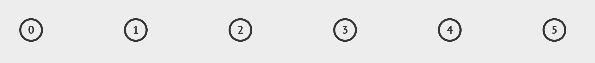
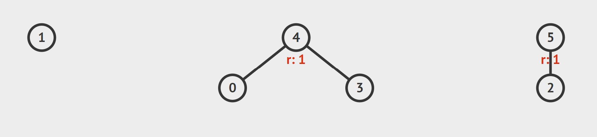
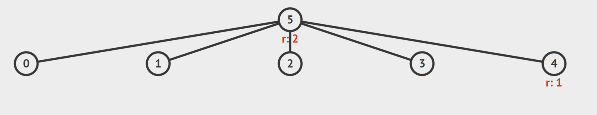

Πολλές φορές στους διαγωνισμούς επιθυμούμε να έχουμε μία δομή δεδομένων η οποία μπορεί εύκολα και γρήγορα να απαντά σε ερωτήματα του τύπου:

- Ένωσε τους κόμβους $$x$$ και $$y$$.
- Είναι οι κόμβοι $$x$$ και $$y$$ ενωμένοι;

Αυτή η δομή δεδομένων υποστηρίζει αυτές τις δύο πράξεις με την βέλτιστη πολυπλοκότητα. Ο Tarjan απέδειξε το 1979 πως η πολυπλοκότητα αυτής της δομής είναι $$O(\alpha(n))$$ amortized. Λίγο αργότερα, το 1989, οι Fredman και Saks απέδειξαν πως δεν μπορεί να υπάρξει δομή με πιο χαμηλή πολυπλοκότητα.

* TOC
{:toc}

## Βασική Ιδέα

Η σελίδα αυτή αφορά μία πολύ εύκολη και χρήσιμο δομή δεδομένων - την Union-Find Disjoint-Sets (UFDS). Αποτελεί μια δομή δεδομένων η οποία μας βοηθά να κρατάμε τις συνδέσεις/ενώσεις (unions) μεταξύ $$Ν$$ διαφορετικών αντικειμένων. Υποστηρίζει δύο ειδών λειτουργίες:

1. Ένωση δύο ομάδων $$x$$ και $$y$$

2. Έλεγχος αν δύο συγκεκριμένα αντικείμενα ανήκουν στην ίδια ομάδα

Για την αναπαράσταση των ομάδων, χρησιμοποιούμε συνδέσεις μεταξύ των αντικειμένων. Το κάθε αντικείμενο έχει ένα «πατέρα» με τον οποίο συνδέεται και άρα είναι στην ίδια ομάδα. Αρχικά όλοι οι κόμβοι έχουν σαν πατέρα τον εαυτό τους.



Παράδειγμα αρχικής κατάστασης για $$Ν = 6$$ αντικείμενα. Ο κάθε κόμβος έχει σαν πατέρα τον εαυτό του και γι’ αυτό μπορούμε να παραλείψουμε την σύνδεση.

Μετά από διάφορες ενώσεις, θα έχουμε δημιουργήσει κάποιες ξένες μεταξύ τους ομάδες, άλλες μεγαλύτερες και άλλες μικρότερες. Η κάθε ομάδα θεωρείται ως η ομάδα του «προγόνου» όλων των παραπάνω κόμβων.

      

Πιο πάνω έχουμε 3 ομάδες. Ο πατέρας του κάθε κόμβου είναι ο κόμβος που βρίσκεται ακριβώς από πάνω του. Άρα ο πατέρας του 3 είναι ο 4 και του 1 ο εαυτός του.

Η πρώτη ομάδα $$\{1\}$$ θεωρούμε πως ανήκει στον 1

Η δεύτερη ομάδα $$\{0, 3, 4\}$$ θεωρούμε πως ανήκει στον 4

Η τρίτη ομάδα $$\{2, 5\}$$ θεωρούμε πως ανήκει στον 5

Για να συγχωνεύσουμε δύο ομάδες στις οποίες ανήκει το αντικείμενο $$x$$ και $$y$$, πρέπει πρώτα να βρούμε το αντικείμενο στο οποίο ανήκει η κάθε ομάδα. Εύκολα καταλαβαίνουμε πως ο «ιδιοκτήτης» της ομάδας $$x$$ είναι ο πιο μακρινός πρόγονος του $$x$$ (πιθανό και ο εαυτός του). Ομοίως και για το $$y$$.

Έτσι, αν βρούμε τους ιδιοκτήτες των ομάδων $$x$$ και $$y$$, μένει να τους συνδέσουμε κάνοντας τον ένα πατέρα του άλλου. Έστω $$PX$$ και $$PY$$ οι ιδιοκτήτες των ομάδων του $$x$$ και του $$y$$ αντίστοιχα. Μπορούμε να κάνουμε τον $$PY$$ πατέρα του $$PX$$ ή το αντίστροφο. Εντούτοις, η σωστή επιλογή του πατέρα μπορεί να βελτιώσει κατά πολύ την πολυπλοκότητα της δομής μας.



## Διάφορες Βελτιστοποιήσεις

### Union by Rank

Αρχικά παρατηρούμε πως όσο πιο «ρηχά» τα δέντρα των ομάδων, τόσο λιγότερες πράξεις χρειαζόμαστε για να βρούμε τον πρόγονο ενός κόμβου και άρα να συγχωνεύσουμε τις ομάδες. Έτσι θα επιλέγουμε την σύνδεση μεταξύ $$PX$$ και $$PY$$ η οποία θα μας δίνει το πιο ρηχό δέντρο (το δέντρο με το μικρότερο ύψος).

Έστω $$hx$$ το ύψος του δέντρου του $$PX$$ και αντίστοιχα $$hy$$ το ύψος του $$PY$$ δέντρου.

Αν $$hx = hy$$, τότε με όποιο τρόπο και να συνδέσουμε τα δύο δέντρα, το αποτέλεσμα θα έχει ύψος $$hx+1$$ (θα αυξηθεί κατά ένα).

Αν $$hx < hy$$, τότε συμφέρει να βάλουμε το PY σαν πατέρα του PX, καθώς έτσι το ύψος του νέου δέντρου θα είναι $$\max\{hx+1, hy\} = hy$$. Στην αντίθετη περίπτωση το νέο ύψος θα ήταν $$\max\{hx, hy+1\} = hy+1$$.

Αν $$hx > hy$$, εργαζόμαστε όπως πιο πάνω και καταλήγουμε πως πρέπει να γίνει ο $$PX$$ πατέρας του $$PY$$.

Συμπερασματικά, είναι πάντα καλύτερο να κάνουμε πατέρα από τους δύο «προγόνους» αυτόν που έχει το μεγαλύτερο ύψος το δέντρο του.

Αποδεικνύεται πως με αυτή την τεχνική η πολυπλοκότητα της δομής έχει βελτιωθεί από $$O(N)$$ σε $$O(\log N)$$, όπου $$Ν$$ ο αριθμός των αντικειμένων.

```c++
int pre[N]; // pre[i]: πατέρας του i κόμβου
int height[N]; // height[i]: το ύψος του δέντρου του i κμβου

int find_pre(int x) { // συνάρτηση που επιστρέφει τον πρόγονο του x
    if (pre[x] == x)  // είναι ο ανώτατος πρόγονος
        return x;
    else  // αλλιώς προχώρα στον πατέρα του
        return find_pre(pre[x]);
}

void UnionSet(int x, int y) {
    int PX = find_pre(x); // πρόγονος x
    int PY = find_pre(y); // πρόγονος y
    
    if (height[PX] < height[PY]) // αν το δέντρο του PY είναι πιο βαθύ, κάνε τον πατέρα του PX
        pre[PX] = PY;
    else // αλλιώς κάνε τον PX πατέρα του PY
        pre[PY] = PX;
        
    if (height[PX] == height[PY]) // αν έχουν τα ίδια ύψη, τότε αύξησε το ύψος του κόμβου που έγινε πατέρας
        height[PX] ++;
}
```

Η λειτουργία 2 όπως περιγράψαμε πιο πάνω, δηλαδή ο έλεγχος αν δύο αντικείμενα ανήκουν στην ίδια ομάδα, μπορεί να υλοποιηθεί πολύ εύκολα κάπως έτσι:

```c++
bool isSame(int x, int y) {
    int PX = find_pre(x); // πρόγονος x
    int PY = find_pre(y); // πρόγονος y
    if (PX == PY)
        return true; // κοινός πρόγονος, ίδια ομάδα
    return false;
}
```

### Path Compression

Είναι μια τελευταία τεχνική η οποία μπορεί να βελτιώσει ακόμα περισσότερο την πολυπλοκότητα της δομής μας. Με την εύρεση του «προγόνου» ενός αντικειμένου, μπορούμε να ενώσουμε απευθείας όλους του ενδιάμεσους προγόνους του στον μεγαλύτερο πρόγονο, μειώνοντας το ύψος του δέντρου και αυξάνοντας το πλάτος του!

Πιο πάνω φαίνεται αρχικά το δέντρο του κόμβου 7. Κάτω φαίνεται ξανά το δέντρο μετά την συμπίεση του μονοπατιού από το αντικείμενο 8.

Παρατηρούμε πως το ύψος του δέντρου μειώθηκε από 4 σε 3.

Οι αλλαγές στον κώδικα είναι ελάχιστες και περιορίζονται μόνο στην συνάρτηση find_pre. Μαζί δίνεται και μια συνάρτηση που προετοιμάζει τους πίνακες pre και height.

```c++
void initialize() { // προετοιμάζει τους πίνακες
    for (int i=0; i<N; i++) {  // πριν ξεκινήσει τη δομή
        pre[i] = i; // πρόγονος του, ο εαυτός του
        height[i] = 0; // ύψος δέντρου = 0
    }
}

int find_pre(int x) { // επιστρέφει τον πρόγονο του x
    if (pre[x] == x) // είναι ανώτατος πρόγονος
        return x;
    else {          // αλλιώς προχώρα στον πατέρα του
        pre[x] = find_pre(pre[x]);  // ο πατέρας του είναι πλέον ο πρόγονος του
        return pre[x];   
    }
}
```

### Τελική Πολυπλοκότητα

Η πολυπλοκότητα των union-find disjoint sets, μαζί με τα δύο αυτά τρικ έχει γίνει τελικά $$O(\alpha(N))$$, όπου $$\alpha(N)$$ είναι το inverse Ackermann function. Για τιμές του $$Ν$$ οι οποίες εμφανίζονται στους διαγωνισμούς, $$N \leq 10^6$$, ισχύει πως $$\alpha(N) \leq 6$$. Έτσι πολλές φορές το θεωρούμε πρακτικά σαν $$O(1)$$.

### Practice Problems
[Codechef: Matrix] (https://www.codechef.com/problems/MTRWY)
